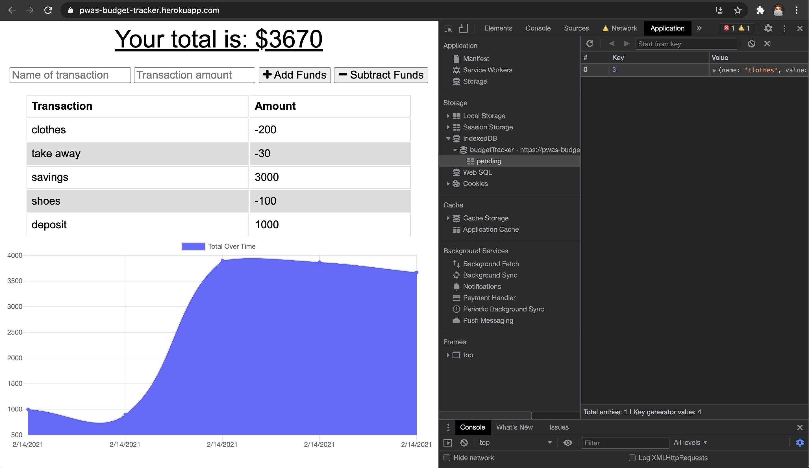
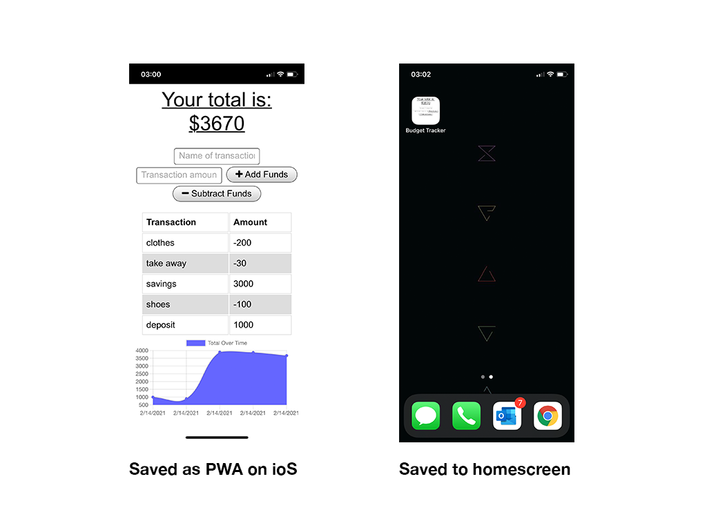

 

# A Handy Budget Tracker

## Description
For this project I was tasked with adding functionality to the existing Budget Tracker application to allow for offline access and functionality. This was achieved with PWA mainfest and service worker files and indexedDB. 

The application allows the user to add expenses and deposits to their budget with or without a connection. When entering transactions offline, they should populate the total when brought back online.

Offline Functionality:
  * Enter deposits offline 
  * Enter expenses offline 

When brought back online:
  * Offline entries should be added to tracker.

### User Story

> As a **avid traveller**, I want to **I WANT to be able to track my withdrawals and deposits with or without a data/internet connection** so that **my account balance is accurate when I am traveling**.

## Table of Contents
- [Preview](#Preview)
- [Execute](#Execute)
- [Contributing](#Contributing)
- [License](#License)
- [Environment](#Environment)
- [Questions](#Questions)
- [Resources](#Resources)

## Preview

> Visit the deployed application on [Heroku](https://pwas-budget-tracker.herokuapp.com/).

#### Offline view with indexedDB store

#### PWA saved on ios iPhone X

## Execute
Clone the repo and in the command line run `npm install` or shortcut `npm i` to download all the npm package dependancies which include: Node Express and Mongoose.

Then invoke the application with command `node server.js` or by using the nodemon script `npm run dev`.

## Contributing
Contributions are welcomed.

## License
MIT

## Environment
* [Visual Studio Code](https://code.visualstudio.com/)
* [Git](https://git-scm.com/book/en/v2/Getting-Started-Installing-Git)
* [Node.js](https://nodejs.org/en/)
* [NPM](https://www.npmjs.com/)
* [Express](https://www.npmjs.com/package/express)
* [Postman](https://www.postman.com/)
* [Heroku](https://www.heroku.com/)
* [Robo3T](https://robomongo.org/)
* [MongDb Atlas](https://www.mongodb.com/cloud/atlas)
* [Mongoose](https://mongoosejs.com/)
* [indexedDB](https://developer.mozilla.org/en-US/docs/Web/API/IndexedDB_API)

## Resources
* [Net Stuff](http://www.dotnet-stuff.com/tutorials/html-5-tutorials/html-5-indexeddb)